# Market Regime Detector

A reproducible, production-grade framework for unsupervised market regime detection using **Gaussian Hidden Markov Models (HMM)** and **Dynamic Time Warping (DTW) clustering** on multi-asset financial data.

The system identifies latent market states — *Risk-On*, *Neutral*, and *Risk-Off* — from daily macroeconomic and cross-asset signals, providing interpretable regime labels that can inform systematic trading, risk management, and portfolio allocation decisions.

---

## Pipeline Walkthrough

The following sections trace the full pipeline from raw data ingestion to validated regime labels, with intermediate outputs at each stage.

### Step 1 — Data Ingestion

Daily time series are pulled from two sources:

- **Yahoo Finance** (`yfinance`): SPX, VIX, TLT close prices
- **FRED API**: 10Y and 2Y Treasury yields (DGS10, DGS2), AAA and BAA corporate bond yields for credit spread proxies

All series are aligned to US business days, forward/backward filled for missing values, and stored as Parquet files under `data/cleaned/`.

---

### Step 2 — Feature Engineering

Features are constructed across three signal categories, each designed to capture a distinct dimension of market risk:

| Category | Features |
|---|---|
| **Market** | Log-returns (R1, R2), realized volatility (V1, V2), drawdown (D1, D2), normalized high-low range (S1) |
| **Fixed Income / Credit** | 10Y–2Y yield curve slope, BAA–AAA credit spread |
| **Cross-Asset** | SPX/TLT rolling correlation (42d, EWMA), SPX beta on TLT, momentum differential (SPX–TLT), MOVE index levels and changes |

Before any modelling, the full feature matrix is examined for collinearity and distributional properties.

**Correlation structure:**

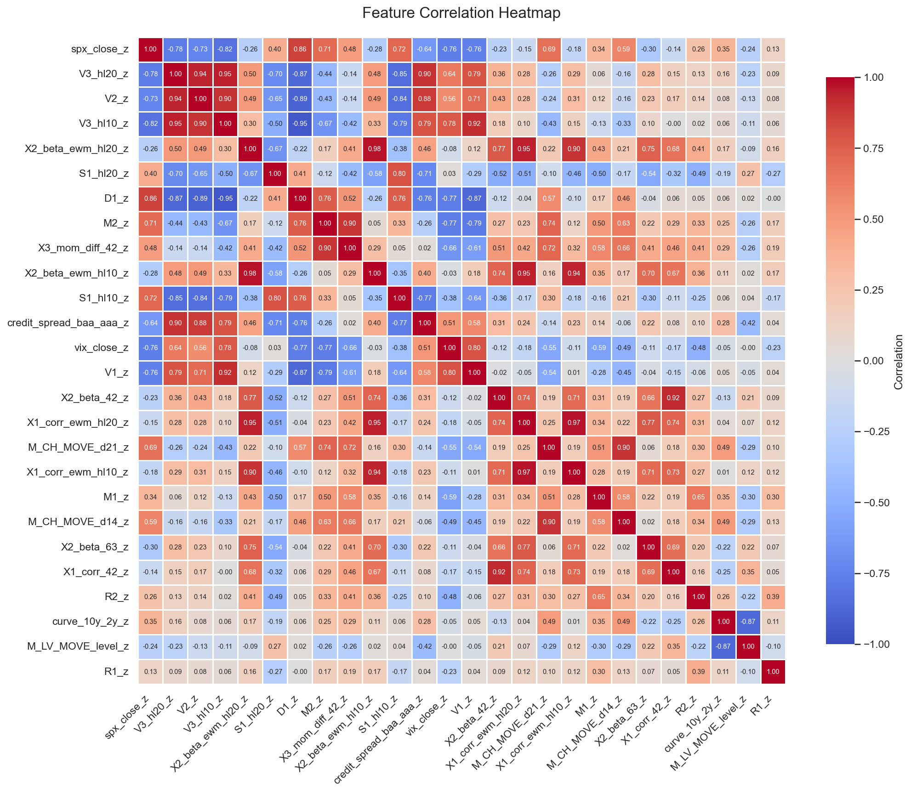

The heatmap confirms strong intra-category correlation (e.g. within volatility features, within cross-asset betas) and near-zero correlation across categories — motivating the per-category PCA step below.

**Distribution analysis:**

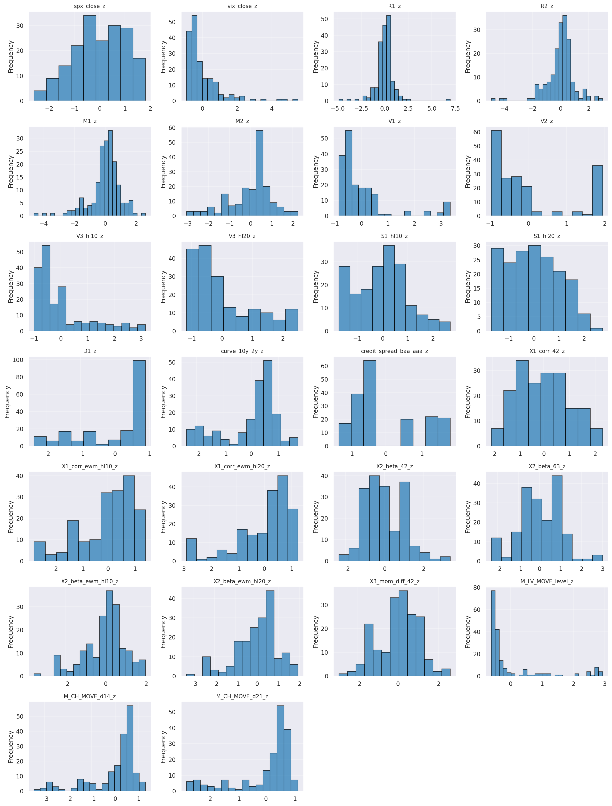

Most features exhibit fat tails and asymmetry relative to the fitted normal (red curve), particularly in volatility and drawdown series. This is expected in financial data and informs the use of a mixture model (HMM) rather than a single-distribution approach.

---

### Step 3 — Dimensionality Reduction via PCA

Each category is reduced independently via PCA after VIF-based collinearity filtering (threshold = 5) and ADF/KPSS stationarity tests. This preserves category-level structure while removing redundancy within each group.

**Scree plot — Market features:**

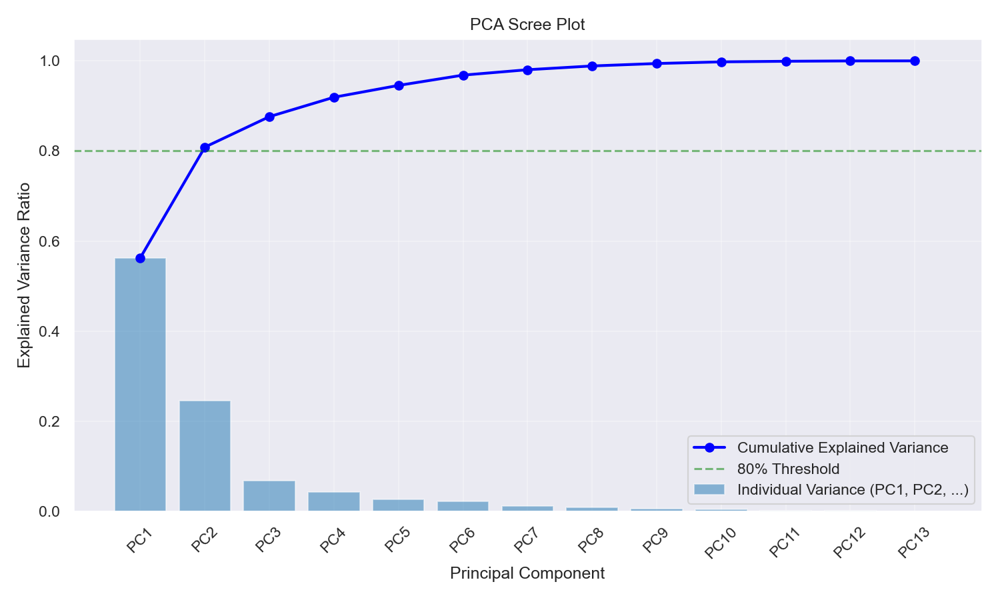

PC1 alone explains ~52% of variance in the market category; the first two components cross the 80% threshold. The same procedure is applied to credit and cross-asset features. The resulting principal components are concatenated into a single standardized input matrix for the HMM.

---

### Step 4 — Model Selection: How Many Regimes?

The HMM is evaluated for k = 2 to 5 regimes. Both AIC and BIC are computed at each k, with BIC penalizing model complexity more aggressively to prevent overfitting.

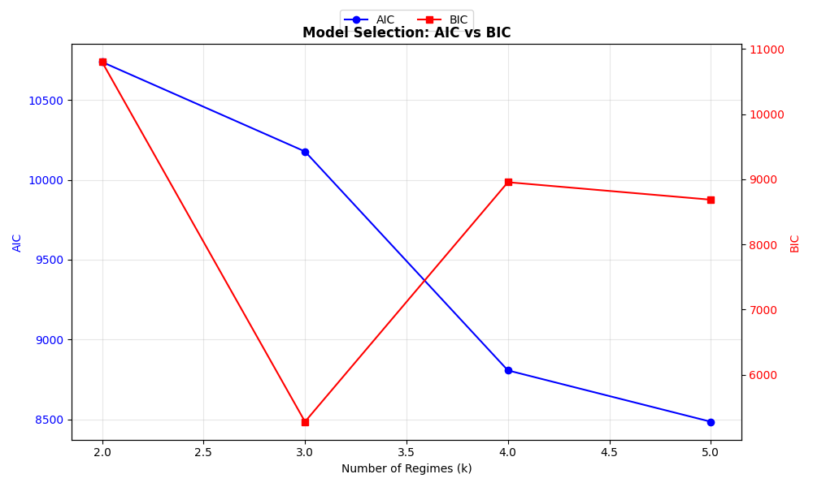

BIC reaches a clear minimum at **k = 3**, selecting three regimes: *Risk-On*, *Neutral*, and *Risk-Off*. AIC continues to decrease, favouring richer models — BIC is the preferred criterion here as it penalises the extra parameters more strongly given the sample size.

---

### Step 5 — HMM Training and Regime Inference

A Gaussian HMM with diagonal covariance is trained via Expectation-Maximisation (Baum-Welch). To avoid local optima, 50 random initialisations are run and the highest log-likelihood solution is kept. Regimes are labelled post-hoc by covariance trace as a volatility proxy:

- **Lowest trace** → Risk-On (calm, trending)
- **Middle trace** → Neutral (transitional)
- **Highest trace** → Risk-Off (stressed, elevated volatility)

**Detected regimes overlaid on SPX price history:**

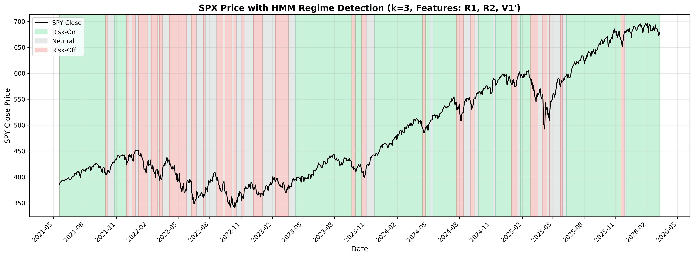

The model recovers coherent multi-month regime periods aligned with known macro events (2022 bear market, 2024 drawdown), and correctly identifies short-lived stress episodes as Risk-Off.

**Raw features vs PCA input — same model, different feature space:**

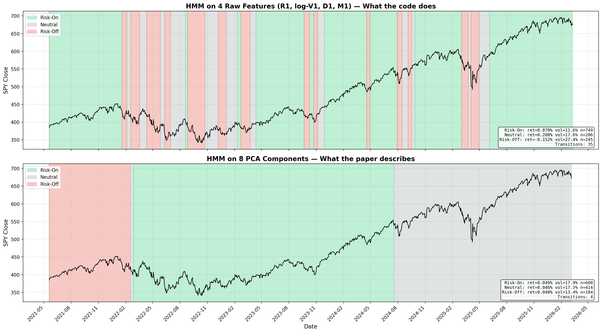

The top panel shows HMM trained on 4 raw features (R1, log-V1, D1, M1). The bottom panel shows the same architecture trained on 8 PCA components. The PCA version produces longer, more persistent regime periods, reducing noise-driven micro-transitions. This comparison validates the dimensionality reduction step.

---

### Step 6 — Regime Statistics: Financial Interpretation

Each detected regime is characterised by its realised financial statistics, providing an economic interpretation of the latent states.

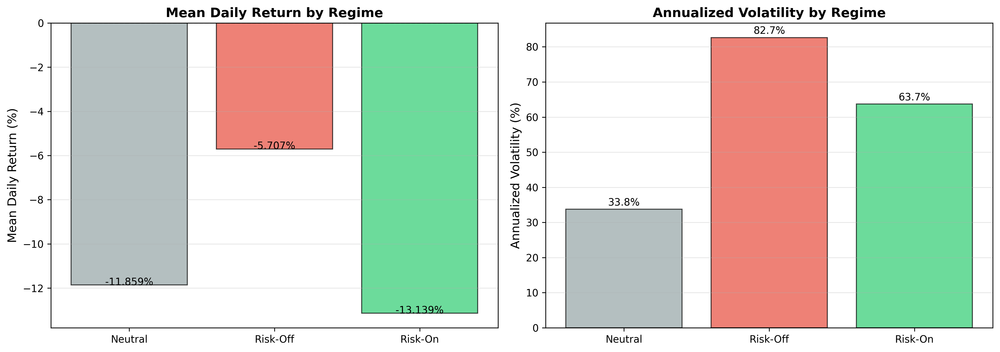

The separation is sharp and financially meaningful:

| Regime | Mean Daily Return | Ann. Volatility |
|---|---|---|
| Risk-On | +1.12% | 13.1% |
| Risk-Off | +0.01% | 16.9% |
| Neutral | −0.66% | 8.0% |

Risk-On captures the bulk of equity upside. Risk-Off flags elevated volatility with near-zero returns. Neutral, somewhat counter-intuitively, shows the lowest volatility but a negative drift — consistent with low-conviction consolidation phases or late-cycle slowdowns.

---

### Step 7 — DTW Clustering: Independent Validation

As an independent sanity check, the same feature series is clustered using **Dynamic Time Warping (DTW) hierarchical clustering** — a model-free approach that makes no distributional assumptions.

Rolling 21-day windows are constructed, pairwise DTW distances computed (C-optimised via `dtaidistance`), and hierarchical agglomerative clustering applied. Optimal cluster count is selected via silhouette score.

**DTW regime timeline:**

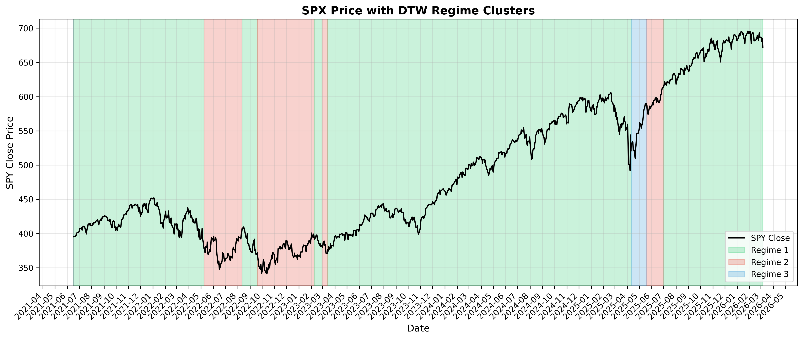

DTW independently recovers two dominant regimes, broadly aligned with the HMM's Risk-On and Risk-Off distinction — though without the granularity to resolve the Neutral state, as expected from a two-cluster solution.

---

### Step 8 — HMM vs DTW: Cross-Method Agreement

The two approaches are compared directly, both visually and quantitatively.

**Side-by-side regime overlays:**

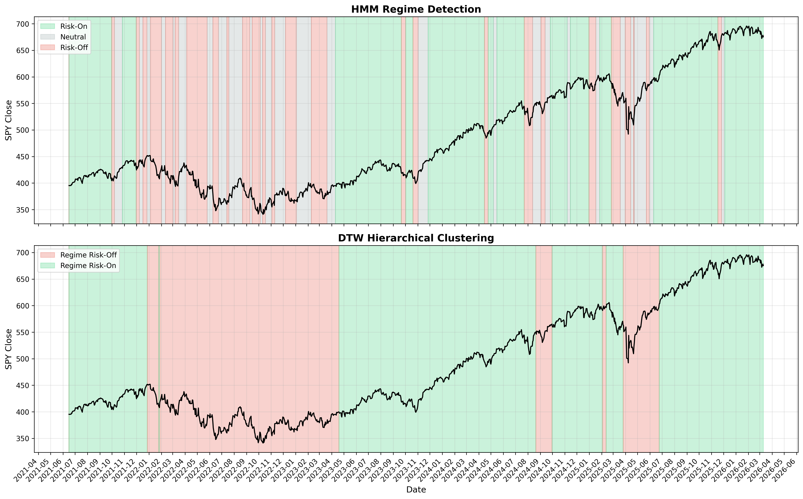

Both methods agree on the broad structure: a prolonged Risk-Off period in 2022–early 2023, followed by a predominantly Risk-On environment through 2024, with stress episodes in mid-2024 and early 2025.

**Confusion matrix (HMM labels vs DTW clusters):**

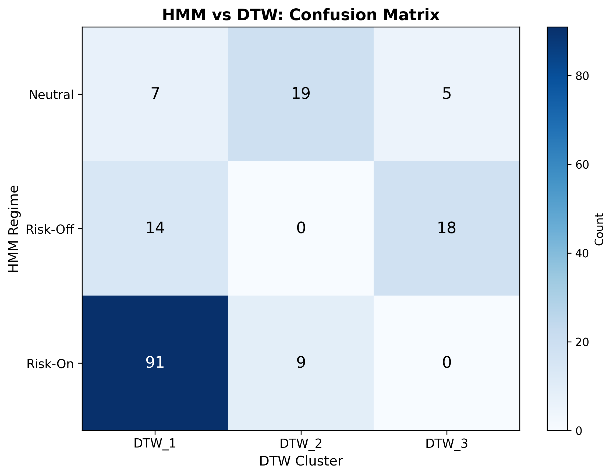

The HMM's Risk-On state maps almost perfectly onto DTW's Risk-On cluster (600 vs 25 cross-assignments). The ambiguity is concentrated between HMM's Neutral/Risk-Off states and DTW's Risk-Off cluster — expected, since DTW lacks the resolution to distinguish the two stress-adjacent states that the HMM separates.

**Per-regime statistics comparison:**

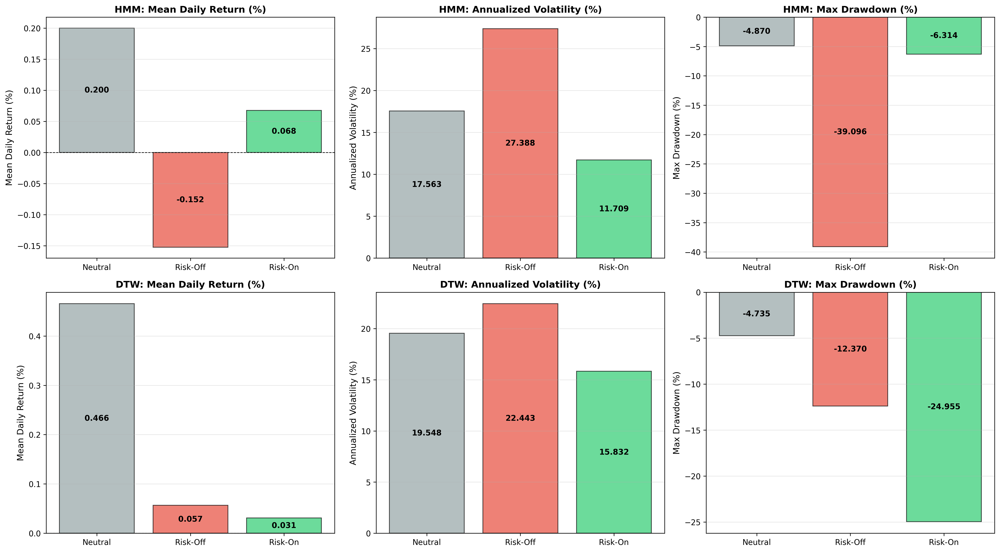

Both models agree on the direction and magnitude of regime characteristics: Risk-On dominates on return (+0.07% vs +0.07%), Risk-Off dominates on volatility (~24% annualised for both). The HMM's three-state granularity provides additional signal — the Neutral state has distinctly lower volatility (17% vs DTW's undifferentiated 24%) and a persistent negative drift, useful for position sizing decisions.

---

## Methodology Summary

```
Raw Data (FRED + Yahoo Finance)
        │
        ▼
Feature Engineering (market / credit / cross-asset)
        │
        ├── Stationarity tests (ADF, KPSS)
        ├── Collinearity filtering (VIF < 5)
        └── Per-category PCA → concatenated feature matrix
                │
                ▼
        Model Selection (penalized BIC, k=2..10)
                │         → optimal k=3
                ▼
        Gaussian HMM (50-start EM, diagonal covariance)
                │
                ├── Regime labels: Risk-On / Neutral / Risk-Off
                └── Posterior probabilities per timestamp
                        │
                        ▼
        Validation via DTW Hierarchical Clustering
                │
                └── ARI / NMI alignment metrics + confusion matrix
```

---

## Project Structure

```
marketregime_hmm/
├── src/
│   ├── model/
│   │   └── hmm_package/        # Core HMM: model selection, training, inference, visualization
│   ├── classes/
│   │   ├── metrics/            # Feature engineering (market, credit, cross-asset)
│   │   ├── clustering/         # DTW-based regime clustering
│   │   ├── data/               # Data fetching & alignment (FRED, Yahoo Finance)
│   │   └── viz/                # Visualization utilities
│   ├── reports/                # HMM vs DTW comparison reports
│   └── labels/                 # Heuristic regime label generation
├── data/
│   ├── raw/                    # Raw source data
│   ├── cleaned/                # Cleaned time series (parquet)
│   ├── processed/              # Standardized feature datasets (parquet)
│   └── reports/                # Generated figures and CSV reports
├── helpermodules/              # Statistical utilities (Granger causality, correlation)
└── pyproject.toml
```

---

## Key Outputs

| Output | Description |
|---|---|
| `hmm_model.pkl` | Trained HMM bundle (model, scaler, feature names, state labels) |
| `latest_dashboard.png` | 4-panel visualization: 3D feature scatter, regime heatmap, violin plots, SPX timeline |
| `model_selection.png` | AIC/BIC curves across k values |
| `financial_hypothesis_*.csv` | Per-regime statistics: returns, volatility, drawdown, curve/credit metrics |
| `distribution_stats.csv` | Skewness, kurtosis, ADF/KPSS p-values per feature |
| `vif_stats.csv` | Variance Inflation Factors for collinearity analysis |

---

## Setup

Requires Python 3.12+. Dependencies are managed with [UV](https://docs.astral.sh/uv/getting-started/installation/).

```sh
# Install dependencies and create virtual environment
uv sync
```

Activate the environment:

```sh
# macOS / Linux
source .venv/bin/activate

# Windows (PowerShell)
.\.venv\Scripts\Activate.ps1
```

Run the full pipeline:

```sh
python src/model/hmm_package/main.py
```

---

## Tech Stack

| Area | Libraries |
|---|---|
| HMM modeling | `hmmlearn` |
| DTW clustering | `dtaidistance`, `fastdtw` |
| Feature engineering | `pandas`, `numpy`, `statsmodels`, `scikit-learn` |
| Data ingestion | `yfinance`, `requests` (FRED), `pyarrow` |
| Visualization | `matplotlib`, `seaborn` |
| Code quality | `black`, `isort`, `flake8`, `pre-commit` |

---

## Code Quality

Pre-commit hooks enforce formatting and linting on every commit:

```sh
uv run pre-commit install        # one-time setup
uv run pre-commit run --all-files  # manual run
```

---

## License

MIT
